# 剑指offer
本笔记用于记录三刷剑指offer，重点为实现自己对于题目的理解和解法。

[TOC]

## 9.用两个栈实现队列

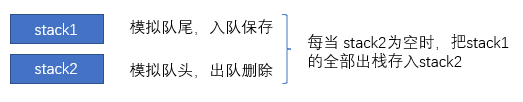

```python
class CQueue:

    def __init__(self):
        self.A ,self.B = [],[]

    def appendTail(self, value: int) -> None:
        self.A.append(value)

    def deleteHead(self) -> int:
        if not self.B:#为空时
            while self.A: #从A拿过来
                self.B.append(self.A.pop())
            if self.B:
                return self.B.pop()
            else:
                return -1
        else :
            return self.B.pop()


# Your CQueue object will be instantiated and called as such:
# obj = CQueue()
# obj.appendTail(value)
# param_2 = obj.deleteHead()
```

- 时间复杂度`appendTail()`函数为 *O*(1) ；`deleteHead()` 函数在 *N* 次队首元素删除操作中总共需完成 *N* 个元素的倒序。
- 空间复杂度*O*(N):最差情况保存N个元素。

## 30.包含min函数的栈

用两个stack，分别功能如下：

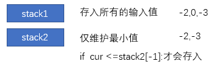

```python
class MinStack:
    def __init__(self): #注意后续都要加self
        self.A, self.B = [],[]

    def push(self,x:int) -> None:
        self.A.append(x)
        if not self.B or self.B[-1] >=x: #注意是大于等于
            self.B.append(x)
      
    def pop(self) -> None:
        if self.A.pop() == self.B[-1]:
            self.B.pop()
        
    def top(self) -> int :
    	return self.A[-1]
    
    def min(self) -> int :
        return self.B[-1]
```

- 时间复杂度*O(1)*
- 空间复杂度*O(N)*

**<栈与队列>小总结：今天的两题都是对两个stack进行操作，一个用于接收新数据，另一个用于辅助完成对应的功能。很奇妙的思路。**

------

## 6.从尾到头打印链表

```python
#递归
class Solution:
    def reversePrint(self, head: ListNode) -> List[int]:
        def recur(head):
            if not head:return
            recur(head.next)
            res.append(head.val)
     	res = []
        recur(head)
        return res
```

- 时间复杂度*O*(N)
- 空间复杂度*O*(N)

```python
#辅助栈
class Solution:
    def reversePrint(self, head: ListNode) -> List[int]:
        res = []
        while head!=None :
            res.append(head.val)
            head=head.next
        return res[::-1]
```

- 时间复杂度*O*(N)
- 空间复杂度*O*(N)

## 24.反转列表

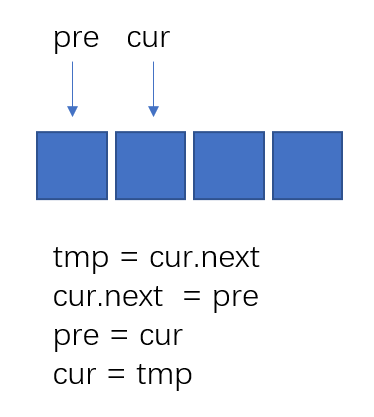

```python
#迭代（双指针）
class Solution:
    def reverseList(self, head: ListNode) -> ListNode:
        cur = head
        pre = None
        while cur:
            tmp = cur.next
            cur.next = pre
            pre = cur
            cur = tmp
        return pre
```

- 时间复杂度*O*(N) ：遍历一遍
- 空间复杂度*O*(1)：指针常数的额外空间

递归遍历链表，当越过尾结点后终止递归，回溯时修改各节点的`next`引用指向（这是递归的精髓）

```python
#递归
class Solution:
    def reverseList(self, head: ListNode) -> ListNode:
        def recur(cur,pre):
            if not cur:return pre #终止条件
            res = recur(cur.next,cur)#递归后继节点
            cur.next = pre #修改节点引用指向
            return res # 返回反转链表的头结点
        return recur(head,None)
```

这个递归代码很巧妙的一步是`res`,一直都是`最后一个节点的位置`！

- 时间复杂度*O*(N)：一轮遍历。
- 空间复杂度*O*(N)：遍历链表的递归深度为N，使用N的额外空间。

## 35.复杂链表的复制

当考虑直接复制的时候，由于`.random`无法确定，因此无法直接遍历一遍复制得到结果。

两种方法：`哈希表`和 `拼接+拆分`

```python
# 哈希表
"""
# Definition for a Node.
class Node:
    def __init__(self, x: int, next: 'Node' = None, random: 'Node' = None):
        self.val = int(x)
        self.next = next
        self.random = random
"""
class Solution:
    def copyRandomList(self, head: 'Node') -> 'Node':
        if not head: return None
        cur = head
        dic = {}
        # 构建 原链表->新链表 的字典
        while cur:
            dic[cur] = Node(cur.val)
            cur = cur.next
        cur = head
        # 构建 新节点的next和random指向
        while cur:
            dic[cur].next = dic.get(cur.next)
            dic[cur].random = dic.get(cur.random)
            cur = cur.next
        return dic[head]
```

- 时间复杂度*O*(N)： 两列遍历
- 空间复杂度*O*(N) ：哈希表`dic`使用线性大小的额外空间

```PYTHON
# 拼接+拆分
class Solution:
    def copyRandomList(self, head: 'Node') -> 'Node':
        if not head : return None
        cur = head
        # 1.复制链表 变为node1->new node1 -> node2 -> new node2 ...
        while cur:
            node = Node(cur.val)
            node.next = cur.next
            cur.next = node
            cur = node.next
        # 2.给new链表指向相应的指针
        cur = head
        while cur:
            if cur.random:
                cur.next.random = cur.random.next
            cur = cur.next.next
        # 3.拆分（不能一步到位，否则两个链表还是有关联的）
        res = cur = head.next
        pre = head
        while cur.next:
            pre.next = pre.next.next
            cur.next = cur.next.next
            pre = pre.next
            cur = cur.next
        pre.next = None
        return res
```

着重注意拆分的时候的代码，顺序是有问题的，建议画图分析。

- 时间复杂度*O*(N) ：三轮遍历链表。
- 空间复杂度*O*(1) ：节点引用变量使用常数大小的额外空间。

**<链表（简单）>总结：**

**3道链表题，注意前两天用递归的时候，是在回溯的时候做需要的操作。**

**链表题的关键是对指针的理解，尤其涉及多个next的时候，画图更清晰。**

------

## 05.替换空格

感觉主要是考察c++语法的原地替换，但是python黑魔法。

```python
class Solution:
    def replaceSpace(self, s: str) -> str:
        res =[]
        for c in s :
            if c == " ": res.append("%20")
            else : res.append(c)
        return ''.join(res)
        #join这个方法，将可迭代的数据类型，转为字符串或者bytes，没错可以转为bytes类型。注意这个可迭代的数据中的元素必须是相同类型的。
```

- 时间复杂度*O*(N) ：遍历链表。
- 空间复杂度*O*(N) 

```c++
// c++原地修改
class Solution {
public:
    string replaceSpace(string s) {
        int count = 0, len = s.size();
        // 统计空格数量
        for (char c : s) {
            if (c == ' ') count++;
        }
        // 修改 s 长度
        s.resize(len + 2 * count);
        // 倒序遍历修改
        for(int i = len - 1, j = s.size() - 1; i < j; i--, j--) {
            if (s[i] != ' ')
                s[j] = s[i];
            else {
                s[j - 2] = '%';
                s[j - 1] = '2';
                s[j] = '0';
                j -= 2;
            }
        }
        return s;
    }
};

作者：Krahets
链接：https://leetcode.cn/leetbook/read/illustration-of-algorithm/50c26h/
来源：力扣（LeetCode）
著作权归作者所有。商业转载请联系作者获得授权，非商业转载请注明出处。
```

- 时间复杂度*O*(N) ：遍历链表。
- 空间复杂度*O*(1) 

## 58-II.左旋转字符串

方法1：字符串切片

```python
class Solution:
    def reverseLeftWords(self, s: str, n: int) -> str:
        return s[n:] + s[:n]
```

- 时间复杂度*O*(*N*)
- 空间复杂度*O*(*N*) 

方法2：列表遍历拼接

```python
class Solution:
    def reverseLeftWords(self, s: str, n: int) -> str:
		res = []
        for i in range(n,len(s)):
            res.append(s[i])
        for i in range(n):
            res.append(s[i])
        return ''.join(res)
```

- 时间复杂度*O*(*N*)
- 空间复杂度*O*(*N*) 

方法3：字符串遍历拼接

```python
class Solution:
    def reverseLeftWords(self, s: str, n: int) -> str:
		res = ''
        for i in range(n,len(s)):
            res += s[i]
        for i in range(n):
            res += s[i]
        return res
```

- 时间复杂度*O*(*N*)
- 空间复杂度*O*(*N*) 

方法4：三次翻转（C++）

```c++
class Solution {
public:
    string reverseLeftWords(string s, int n) {
        reverseString(s, 0, n - 1);
        reverseString(s, n, s.size() - 1);
        reverseString(s, 0, s.size() - 1);
        return s;
    }
private:
    void reverseString(string& s, int i, int j) {
        while(i < j) swap(s[i++], s[j--]);
    }
};

作者：Krahets
链接：https://leetcode.cn/leetbook/read/illustration-of-algorithm/58eckc/
来源：力扣（LeetCode）
著作权归作者所有。商业转载请联系作者获得授权，非商业转载请注明出处。
```

- 时间复杂度*O*(*N*)
- 空间复杂度*O*(*1*) 

此题的关键，也是对字符串做原地替换，但是这个的前提是C++，python的黑魔法不支持这些操作。

**<字符串（简单）>其实用python很简单，但是少了c++的考点，可以稍微补充一下c++的做法。**

------

## 03.数组中重复的数字

思路1：自己想的最直观的方法

```python
class Solution:
    def findRepeatNumber(self, nums: List[int]) -> int:
        # 排序，遍历
        nums.sort()
        for i in range(1,len(nums)):
            if nums[i-1] == nums[i]:
                return nums[i]
        return nums[0]
```

- 时间复杂度*O*(*N*logN):遍历+排序所需的时间
- 空间复杂度*O*(*1*) ：不引入额外空间

思路2：借助哈希/set

```python
class Solution:
    def findRepeatNumber(self, nums: List[int]) -> int:
        hash = {}
        for num in nums:
            if num in hash:
                return num
            hash[num] = num
        return 0
```

- 时间复杂度*O*(*N*):遍历一遍
- 空间复杂度*O*(*N*) 

因为只需要存一个值，可以用`set`

```python
class Solution:
    def findRepeatNumber(self, nums: [int]) -> int:
        dic = set()
        for num in nums:
            if num in dic: return num
            dic.add(num)
        return -1
```

- 时间复杂度*O*(*N*):遍历一遍
- 空间复杂度*O*(*N*) 

方法3：原地交换

一个萝卜一个坑，如果坑里有萝卜，肯定是重复的萝卜了

```python
class Solution:
    def findRepeatNumber(self, nums: List[int]) -> int:
        for i in range(len(nums)):
            if nums[i] != i:
                if nums[nums[i]] == nums[i]:
                    return nums[i]
                nums[nums[i]], nums[i] = nums[i], nums[nums[i]]
        return nums[0]
```

- 时间复杂度*O*(*N*):遍历一遍
- 空间复杂度*O*(*1*) 

## 53-I.在排序数组中查找数字

```python
class Solution:
    def search(self, nums: List[int], target: int) -> int:
        # 排好序的可以用二分查找
        l, r = 0, len(nums)-1
        while l <= r:
            mid = (l + r) // 2
            # 中间值 比 目标值 大 ，在左侧
            if nums[mid] > target:
                r = mid - 1
            elif nums[mid] < target: #在右侧
                l = mid + 1
            else:# 相等
                if nums[r] != target:
                    r -= 1
                elif nums[l] != target:
                    l += 1
                else:
                    break
        return r - l + 1
```

- 时间复杂度*O*(*logN*):二分
- 空间复杂度*O*(*1*) 

## 53-II.0~n-1中缺失的数字

```python
class Solution:
    def missingNumber(self, nums: List[int]) -> int:
        # 二分
        l, r = 0, len(nums)-1
        while l <= r:
            mid = (l+r)//2
            if nums[mid] > mid:
                r = mid - 1
            elif nums[mid] == mid:
                l = mid + 1
        return l
```

- 时间复杂度*O*(*logN*):二分
- 空间复杂度*O*(*1*) 

**<查找算法（简单）>注意排序数组中用二分法查找最快，默认下标当索引，重点是利用到数组的特性。**

## 04.二维数组中的查找

关键在于数组特性，从左到右递增，从上到下也递增

```python
class Solution:
    def findNumberIn2DArray(self, matrix: List[List[int]], target: int) -> bool:
        if not matrix : return False
        n = len(matrix)
        m = len(matrix[0])
        i, j = n-1, 0
        while i >= 0 and j < m:
            if matrix[i][j] > target:
                i -= 1
            elif matrix[i][j] < target:
                j += 1
            else:
                return True
        return False
```

- 时间复杂度*O*(*N*+*M*):遍历一遍
- 空间复杂度*O*(*1*) 

## 11.旋转数组的最小数字

这道题的分析值得多看两遍，还是很复杂的。尤其是对等号的判断。

看官方题解的视频，可以理解成 二分和暴力法的结合！

```python
class Solution:
    def minArray(self, numbers: List[int]) -> int:
        # 二分 + 暴力
        l, r = 0, len(numbers)-1
        while l < r:
            mid = (l+r)//2
            if numbers[mid] > numbers[r]:
                l = mid + 1
            elif numbers[mid] < numbers[r]:
                r = mid 
            else:
                r -= 1 #暴力
        return numbers[l]
```

- 时间复杂度*O*(*logN*)，但是在数组全部相等的情况下是O(N)
- 空间复杂度*O*(*1*) 

## 50.第一个只出现一次的字符

暴力法了话是O（N^2)，借助常规的空间换时间的思路，引入哈希表：

```python
class Solution:
    def firstUniqChar(self, s: str) -> str:
        dic = {}
        for c in s:
            if c in dic:
                dic[c] += 1
            else:
                dic[c] = 1
        for c in s:
            if dic[c] == 1:
                return c
        return ' '
```

- 时间复杂度*O*(*N*):遍历2遍
- 空间复杂度*O*(*1*) :虽然引入了哈希，但是只有26个字母*O*(*26*) =*O*(*1*)

因为python3.6之后，默认字典是有序的，因此可以写成下面：

```python
class Solution:
    def firstUniqChar(self, s: str) -> str:
        dic = {}
        for c in s:
            dic[c] = not c in dic
        for k, v in dic.items():
            if v: return k
        return ' '
```

相对第一种方法，仅遍历了一遍。

**<查找算法（中等）>，今天的三道题，重点还是分析题目的特性；不过不建议直接背题目的最优解，要自行学习分析思路，第二道旋转数组的最小数字很值得学习，一步一步的分析。**

------

## 32-I.从上到下打印二叉树

二叉树的广度优先搜索（`BFS`）,需要借助队列

```python
class Solution:
    def levelOrder(self, root: TreeNode) -> List[int]:
        if not root:return []
        deque = collections.deque()
        res = []
        deque.append(root)
        while deque:
            node = deque.popleft()
            res.append(node.val)
            if node.left:deque.append(node.left)
            if node.right: deque.append(node.right)
        return res
```

- 时间复杂度*O*(*N*)
- 空间复杂度*O*(*N*) 

## 32-II.从上到下打印二叉树II

```python
class Solution:
    def levelOrder(self, root: TreeNode) -> List[List[int]]:
        if not root:return []
        deque = collections.deque()
        res = []
        deque.append(root)
        while deque:
            tmp = []
            n = len(deque)
            for i in range(n):
                node = deque.popleft()
                tmp.append(node.val)
                if node.left:deque.append(node.left)
                if node.right:deque.append(node.right)
            res.append(tmp)
        return res
```

- 时间复杂度*O*(*N*)
- 空间复杂度*O*(*N*) 

## 32-III.从上到下打印二叉树III

```python
class Solution:
    def levelOrder(self, root: TreeNode) -> List[List[int]]:
        if not root:return []
        deque = collections.deque()
        res = []
        deque.append(root)
        flag = 0
        while deque:
            tmp = collections.deque()
            for _ in range(len(deque)):
                node = deque.popleft()
                if flag%2 == 0:
                    tmp.append(node.val)
                else:
                    tmp.appendleft(node.val)
                if node.left:deque.append(node.left)
                if node.right:deque.append(node.right)
            flag += 1
            res.append(list(tmp))
        return res
```

- 时间复杂度*O*(*N*)
- 空间复杂度*O*(*N*) 

**<搜索与回溯算法（简单）>主要是二叉树的层序遍历，记住要借助双端队列就可以！**

## 26.树的子结构

两个递归；

一个递归是A,一个递归是进行A、B相等判断；

然后分析每一个的终止条件和返回条件；

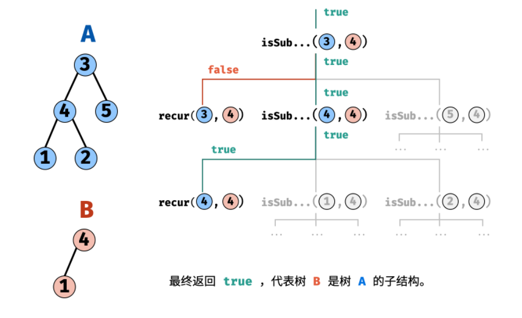

```python
class Solution:
    def isSubStructure(self, A: TreeNode, B: TreeNode) -> bool:
        if not A or not B:return False
        def recur(A,B):
            if not B:return True
            if not A or A.val !=B.val :return False
            return recur(A.left,B.left) and recur(A.right,B.right)
        return recur(A,B) or self.isSubStructure(A.left,B) or self.isSubStructure(A.right,B)
```

- 时间复杂度*O*(*MN*)
- 空间复杂度*O*(*N*) 

## 27.二叉树的镜像

递归：

```python
class Solution:
    def mirrorTree(self, root: TreeNode) -> TreeNode:
        if not root:return
        tmp = root.left
        root.left = root.right
        root.right = tmp
        self.mirrorTree(root.left)
        self.mirrorTree(root.right)
        return root
```

- 时间复杂度*O*(*N*)
- 空间复杂度*O*(*N*) 

辅助栈：

```python
class Solution:
    def mirrorTree(self, root: TreeNode) -> TreeNode:
        #辅助栈仅用于遍历每个节点
        if not root : return root
        res = []
        res.append(root)
        while res:
            node = res.pop()
            if node.left : res.append(node.left)
            if node.right : res.append(node.right)
            node.left ,node.right = node.right, node.left
        return root
```

- 时间复杂度*O*(*N*)
- 空间复杂度*O*(*N*) 

## 28.对称的二叉树

很巧妙的思路

```python
class Solution:
    def isSymmetric(self, root: TreeNode) -> bool:
        # 先遍历，再验证
        def recur(L,R):
            if not L and not R:return True
            if not L or not R or L.val != R.val:return False
            return recur(L.left,R.right) and recur(L.right,R.left)
        return not root or recur(root.left,root.right)
```

**<搜索与回溯算法（简单）>其实和递归的思路很一致，以某种方式遍历，遍历的时候增加条件判断。**

## 10-I.斐波那契数列

```python
class Solution:
    def fib(self, n: int) -> int:
        a,b=0,1
        for _ in range(n):
            a,b = b,(a+b)%1000000007
        return a
```

- 时间复杂度*O*(*N*)
- 空间复杂度*O*(*1*) 

## 10-II.青蛙跳台阶问题

```python
class Solution:
    def numWays(self, n: int) -> int:
        if n == 0: return 1
        if n == 1: return 1
        if n == 2: return 2
        a,b = 1,2
        for _ in range(n-2):
            a ,b = b ,(a+b)%1000000007
        return b
```

- 时间复杂度*O*(*N*)
- 空间复杂度*O*(*1*) 

## 63.股票的最大利润


```python
class Solution:
    def maxProfit(self, prices: List[int]) -> int:
        if not prices:return 0
        m_min = prices[0]
        res = 0
        for i in prices:
            if i < m_min:
                m_min = i
            res = max(i-m_min,res)
        return res
```

- 时间复杂度*O*(*N*)
- 空间复杂度*O*(*1*) 

## 42.连续子数组的最大和

动态规划!


```python
class Solution:
    def maxSubArray(self, nums: List[int]) -> int:
        for i in range(1,len(nums)):
            nums[i] += max(nums[i-1],0)
        return max(nums)
```

- 时间复杂度*O*(*N*)
- 空间复杂度*O*(*1*) 

## 47.礼物的最大价值

与上一题思路类似

```python
class Solution:
    def maxValue(self, grid: List[List[int]]) -> int:
        n = len(grid)
        m = len(grid[0])
        i,j = 0, 0
        for i in range(n):
            for j in range(m):
                if i == 0 and j==0:
                    continue
                elif i == 0:
                    grid[i][j] += grid[i][j-1]
                elif j == 0:
                    grid[i][j] += grid[i-1][j]
                else:
                    grid[i][j] += max(grid[i][j-1],grid[i-1][j])
        return grid[n-1][m-1]
```

- 时间复杂度*O*(*NM*)
- 空间复杂度*O*(*1*) 

## 46.把数字翻译成字符串

类似跳台阶，但是要增加判断条件;


注意画图，画值分析，而不是一直在脑海中想。

```python
class Solution:
    def translateNum(self, num: int) -> int:
        a = 1
        b = 1
        y = num % 10
        while num>9:
            num //= 10
            x = num % 10
            if 9 < x*10 + y <26:
                c = a + b
            else:
                c = a
            a ,b = c, a
            y = x
        return a
```

- 时间复杂度*O*(*N*)
- 空间复杂度*O*(*1*) 

## 48.最长不含重复字符的子字符串

动态规划:


```python
class Solution:
    def lengthOfLongestSubstring(self, s: str) -> int:
        dic = {}
        res = tmp = 0
        for j in range(len(s)):
            i = dic.get(s[j],-1) # 获取索引 i
            dic[s[j]] = j # 更新哈希表
            tmp = tmp + 1 if tmp < j - i else j - i
            res = max(res,tmp)
        return res
```

- 时间复杂度*O*(*N*)
- 空间复杂度*O*(*1*) 

哈希表+双指针

```python
class Solution:
    def lengthOfLongestSubstring(self, s: str) -> int:
        dic = {}
        i = -1
        res = 0
        for j in range(len(s)):
            if s[j] in dic:
                i = max(dic[s[j]],i)
            dic[s[j]] = j
            res = max(res,j-i)
        return res
```

- 时间复杂度*O*(*N*)
- 空间复杂度*O*(*1*) 

<动态规划>：找到对应的状态和转移方程；

------

## 18.删除链表的节点

```python
class Solution:
    def deleteNode(self, head: ListNode, val: int) -> ListNode:
        if not head:return head
        pre = cur = head
        if cur.val == val:
            return head.next
        cur = cur.next
        while cur:
            if cur.val == val:
                pre.next = cur.next
            cur = cur.next
            pre = pre.next
        return head
```

- 时间复杂度*O*(*N*)
- 空间复杂度*O*(*1*) 

## 22.链表中倒数第k个节点

```python
class Solution:
    def getKthFromEnd(self, head: ListNode, k: int) -> ListNode:
        cur = head
        while k:
            k -= 1
            cur = cur.next
        pre = head
        while cur:
            pre,cur = pre.next,cur.next
        return pre
```

- 时间复杂度*O*(*N*)
- 空间复杂度*O*(*1*) 

## 25.合并两个排序的链表

```python
class Solution:
    def mergeTwoLists(self, l1: ListNode, l2: ListNode) -> ListNode:
        cur1 = l1
        cur2 = l2
        head = res = ListNode(0)
        while cur1 and cur2:
            if cur1.val < cur2.val:
                res.next = ListNode(cur1.val)
                cur1 = cur1.next
            else:
                res.next = ListNode(cur2.val)
                cur2 = cur2.next
            res = res.next
        if cur1 :res.next = cur1
        if cur2 :res.next = cur2
        return head.next
```

- 时间复杂度*O*(*N+M*)
- 空间复杂度*O*(*1*) 

## 52.两个链表的第一个公共节点

```python
# Definition for singly-linked list.
# class ListNode:
#     def __init__(self, x):
#         self.val = x
#         self.next = None

class Solution:
    def getIntersectionNode(self, headA: ListNode, headB: ListNode) -> ListNode:
        cur1, cur2 = headA, headB
        while cur1 != cur2:
            if cur1:#特别需要注意，要把最后的null节点也要加上！
                cur1 = cur1.next
            else:
                cur1 = headB
            if cur2:
                cur2 = cur2.next
            else:
                cur2 = headA
        return cur1
```

- 时间复杂度*O*(*N+M*)
- 空间复杂度*O*(*1*) 

## 21.调整数组顺序使奇数位于偶数前面

注意代码简洁性和可读性！否则自己分析起来就很费劲！

```python
class Solution:
    def exchange(self, nums: List[int]) -> List[int]:
        i, j = 0, len(nums) - 1
        while i < j:
            while i < j and nums[i] & 1 == 1: i += 1
            while i < j and nums[j] & 1 == 0: j -= 1
            nums[i], nums[j] = nums[j], nums[i]
        return nums

作者：Krahets
链接：https://leetcode.cn/leetbook/read/illustration-of-algorithm/5v3rqr/
来源：力扣（LeetCode）
著作权归作者所有。商业转载请联系作者获得授权，非商业转载请注明出处。
```

- 时间复杂度*O*(*N*)
- 空间复杂度*O*(*1*) 

## 57.和为s的两个数字

```python
class Solution:
    def twoSum(self, nums: List[int], target: int) -> List[int]:
        i, j = 0, len(nums)-1
        while i<j:
            if nums[i] + nums[j] < target:
                i += 1
            elif nums[i] + nums[j] > target:
                j -= 1
            else:
                return [nums[i],nums[j]]
        return []
```

- 时间复杂度*O*(*N*)
- 空间复杂度*O*(*1*) 

## 58-I.翻转单词顺序

```python
class Solution:
    def reverseWords(self, s: str) -> str:
        if not s :return ""
        res = []
        i = len(s) - 1
        while i>=0 and s[i] == ' ':
            i -= 1
        j = i
        while i >= 0:
            while i>=0 and s[i] != ' ':
                i -= 1
            res.append(s[i+1:j+1])
            while i>=0 and s[i] == ' ' :
                i -= 1
            j = i
        return ' '.join(res)
```

- 时间复杂度*O*(*N*)
- 空间复杂度*O*(*N*) 

**<双指针（简单）>确实思路都比较简单， 但是关键在于细节，切不可往复杂里增加，边界的判断一定要细致分析。while嵌套while的时候一定要把外层的条件先带上！**

------

## 12.矩阵中的路径

```python
class Solution:
    def exist(self, board: List[List[str]], word: str) -> bool:
        # 深度优先遍历
        def dfs(i,j,k):
            # 如果越界
            if i<0 or j<0 or i>=len(board) or j>= len(board[0]):return False
            # 如果已经遍历过
            if board[i][j] == ' ':return False
            # 如果不是这个元素
            if word[k] != board[i][j]: return False
            # 如果已经到达最后的长度
            if k == len(word)-1:return True
            # 如果是第k个值 继续往下遍历
            board[i][j] = ' '
            res =  dfs(i+1,j,k+1) or dfs(i-1,j,k+1) or dfs(i,j+1,k+1) or dfs(i,j-1,k+1)
            # 要恢复，否则已经遍历过一半，但不是了话，就无法进行下一个节点的遍历
            board[i][j] = word[k]
            return res

        # 外层控制能从每一个节点开始遍历
        for i in range(len(board)):
            for j in range(len(board[0])):
                if dfs(i,j,0):return True
        return False
```

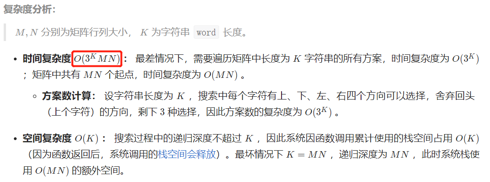

## 13.机器人的运动范围

方法1：深度优先遍历 DFS

```python
class Solution:
    def movingCount(self, m: int, n: int, k: int) -> int:
        # 定义计算函数
        def countsum(a,b):
            s = 0
            while a :
                s += a%10
                a //= 10
            while b:
                s += b%10
                b //= 10
            return s
        # 深度优先遍历
        def dfs(i,j):
            # 越界 
            if i>=m or j>=n:return 0
            # 不符合判断条件
            if countsum(i,j)>k:return 0
            # 已经访问过
            if (i,j) in visited: return 0
            visited.add((i,j))
            return  dfs(i+1,j) + dfs(i,j+1) + 1
        visited = set()
        return dfs(0,0)
```

- 时间复杂度*O*(*NM*)
- 空间复杂度*O*(*NM*) 

方法2：广度优先遍历 BFS

> BFS/DFS ： 两者目标都是遍历整个矩阵，不同点在于搜索顺序不同。
>
> DFS 是朝一个方向走到底，再回退，以此类推；
>
> BFS 则是按照“平推”的方式向前搜索。
>
> BFS 实现： 通常利用队列实现广度优先遍历。

```python
class Solution:
    def movingCount(self, m: int, n: int, k: int) -> int:
        # 定义计算函数
        def countsum(a,b):
            s = 0
            while a :
                s += a%10
                a //= 10
            while b:
                s += b%10
                b //= 10
            return s
        # 广度优先遍历
        queue = [(0,0)]
        visited = set()
        while queue:
            i,j = queue.pop(0)
            if i >= m or j >= n or countsum(i,j)> k or (i,j) in visited :continue
            visited.add((i,j))
            queue.append((i+1,j))
            queue.append((i,j+1))
        return len(visited)
```

颇有之前看的二叉树层序遍历之意。

- 时间复杂度*O*(*NM*)
- 空间复杂度*O*(*NM*) 

**<搜索与回溯（中等）>都可以用深度优先遍历，注意找到递归结束的条件。**

## 34.二叉树中和为某一值的路径

思路：

1.先序遍历；

2.遍历前对是否满足条件进行判断；

3.细节要注意：路径恢复的时候要pop（）；

4.代码细节：

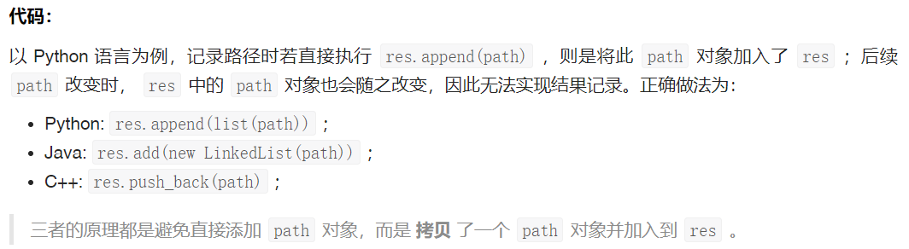

```python
class Solution:
    def pathSum(self, root: TreeNode, sum: int) -> List[List[int]]:
        res, path = [], []
        def recur(root, tar):
            if not root: return
            path.append(root.val)
            tar -= root.val
            if tar == 0 and not root.left and not root.right:
                res.append(list(path))
            recur(root.left, tar)
            recur(root.right, tar)
            path.pop()
        recur(root, sum)
        return res
```

- 时间复杂度*O*(*N*)
- 空间复杂度*O*(*N*) 

## 36.二叉搜索树与双向链表

k神写的很精妙！

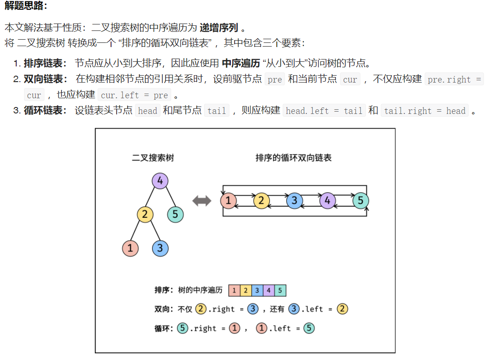

```python
class Solution:
    def treeToDoublyList(self, root: 'Node') -> 'Node':
        def recur(cur):
            if not cur:return
            recur(cur.left)
            if not self.pre: self.head = cur
            else : 
                self.pre.right = cur
                cur.left = self.pre
            self.pre = cur
            recur(cur.right)
        self.pre = None
        self.head = None
        if not root:return root
        recur(root)
        #头尾指针连接 构成循环
        self.head.left = self.pre
        self.pre.right = self.head
        return self.head
```

- 时间复杂度*O*(*N*)
- 空间复杂度*O*(*N*)

## 54.二叉搜索树的第k大节点

还是利用二叉搜索树的中序遍历是一个递增序列的特点，不过这里因为要逆序，所以是先右节点，再左节点。

代码实现上要注意提前终止返回的特点。

```python
class Solution:
    def kthLargest(self, root: TreeNode, k: int) -> int:
        def dfs(root):
            if not root:return
            dfs(root.right)
            if self.k == 0 :return
            self.k -= 1
            if self.k == 0 :self.res = root.val
            dfs(root.left)
        self.k = k
        dfs(root)
        return self.res
```

- 时间复杂度*O*(*N*)
- 空间复杂度*O*(*N*)

**<搜索与回溯（中等）>和二叉树相关的题目，思路都是先明确是用那种遍历方式，然后再在遍历中增加相关的条件！百试不爽，但是要注意代码实现上的细节！**

## 45.把数组排成最小的数

排序的运用，自定义排序的条件。

难点在于手写快速排序，细节上注意递归的条件！

```python
class Solution:
    def minNumber(self, nums: List[int]) -> str:
        def quick_sort(left,right):
            if left >= right:return
            pivot = random.randint(left,right)
            nums[pivot], nums[left] = nums[left], nums[pivot]
            pivot = left
            i, j = left, right
            while i<j:
                while i<j and nums[j] + nums[pivot] > nums[pivot] + nums[j]:
                    j -= 1
                while i<j and nums[i] + nums[pivot] <= nums[pivot] + nums[i]:
                    i += 1
                nums[i], nums[j] = nums[j],nums[i]
            nums[pivot],nums[i] = nums[i],nums[pivot]
            quick_sort(left,i-1)
            quick_sort(i+1,right)
            return nums
        n = len(nums)
        nums = [str(num) for num in nums]
        quick_sort(0,n-1)
        return ''.join(nums)
```

- 时间复杂度*O*(*NlogN*)
- 空间复杂度*O*(*N*)

## 61.扑克牌中的顺子

这道题还是蛮简单的,因为就是五个数，时间和空间复杂度可以忽略不计。

方法1：set()

```python
class Solution:
    def isStraight(self, nums: List[int]) -> bool:
        repeat = set()
        ma,mi = 0, 14
        for num in nums:
            if num == 0 : continue
            ma = max(ma,num)
            mi = min(mi,num)
            if num in repeat:return False
            repeat.add(num)
        return ma - mi < 5
```

- 时间复杂度*O*(*1*)
- 空间复杂度*O*(*1*)

方法2：排序

```python
class Solution:
    def isStraight(self, nums: List[int]) -> bool:
        nums.sort()
        joker = 0
        for i in range(4):
            if nums[i] == 0:
                joker+=1
                continue
            if nums[i] == nums[i+1]:return False
        return nums[4]-nums[joker]<5
```

- 时间复杂度*O*(*1*)
- 空间复杂度*O*(*1*)

<排序（简单）>要熟悉掌握之前总结的那几种排序方式，时常温习。

------

## 40.最小的K个数

基于快速排序的数组划分

```python
class Solution:
    def getLeastNumbers(self, arr: List[int], k: int) -> List[int]:
        if k >= len(arr): return arr
        def quick_sort(left,right):
            if left>=right:return 
            pivot = random.randint(left,right)
            arr[pivot], arr[left] = arr[left], arr[pivot]
            pivot = left
            i, j = left, right
            while i < j:
                while i < j and arr[pivot] < arr[j]: 
                    j -= 1
                while i < j and arr[pivot] >= arr[i]:
                    i += 1
                arr[i], arr[j] = arr[j], arr[i]
            arr[pivot], arr[i] = arr[i], arr[pivot]
            # 提前结束
            if k < i : quick_sort(left,i-1)
            if k > i : quick_sort(i+1,right)
            return 
        quick_sort(0,len(arr)-1)
        return arr[:k]
```

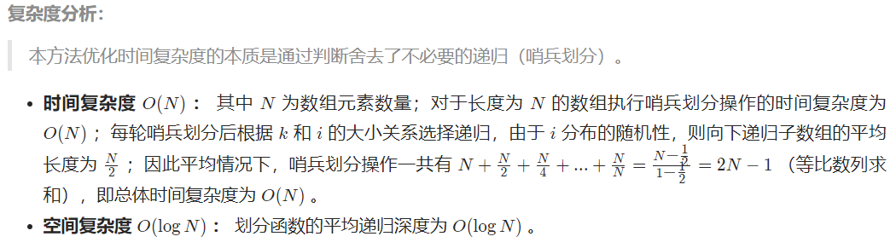

## 41.数据流的中位数

首先补充一下堆的概念：

- 必须是完全二叉树
- 用数组实现
- 任一节点的值是其子树所有节点的最大值or最小值（堆序性）
	- 最大值时，称为：大根堆
	- 最小值时，称为：小根堆

最常见的应用是优先队列；

**本题思路是维护两个堆：一个大根堆、一个小根堆；**


```python
class MedianFinder:

    def __init__(self):
        self.A = []
        self.B = []
	
    def addNum(self, num: int) -> None:
        # 长度不等时，先入A，再入B
        # python默认是小根堆，大根堆需要取反实现
        if len(self.A) != len(self.B):
            heappush(self.A,num)
            heappush(self.B,-heappop(self.A))
        else: # 长度相等时，先入B，再入A
            heappush(self.B,-num)
            heappush(self.A,-heappop(self.B))

    def findMedian(self) -> float:
        if len(self.A) == len(self.B):
            return (self.A[0] - self.B[0])/2.0
        else:
            return self.A[0]
```

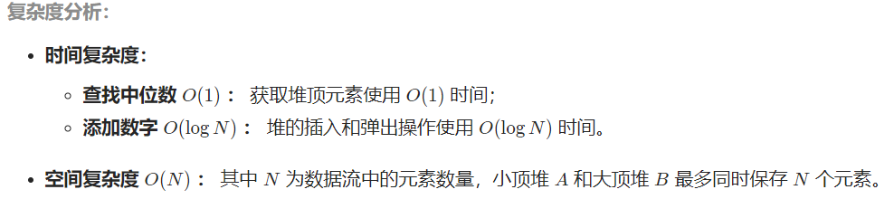

<排序（中等）>快速排序需要加深记忆，堆的概念学习，一道困难题，但其实掌握了思路，代码实现还是蛮简单的。

------

## 55-I.二叉树的深度


```PYTHON
class Solution:
    def maxDepth(self, root: TreeNode) -> int:
        if not root: return 0
        return max(self.maxDepth(root.left),self.maxDepth(root.right)) + 1
```

- 时间复杂度*O*(*N*)
- 空间复杂度*O*(*N*)

层序遍历，自己手写的，while+for是一套组合拳。

```python
class Solution:
    def maxDepth(self, root: TreeNode) -> int:
        # 层序遍历
        if not root: return 0
        res = 0
        deque = collections.deque()
        deque.append(root)
        while deque:
            for _ in range(len(deque)):
                node = deque.popleft()
                if node.left:deque.append(node.left)
                if node.right: deque.append(node.right)
            res += 1
        return res
```

- 时间复杂度*O*(*N*)
- 空间复杂度*O*(*N*)

## 55-II.平衡二叉树

**方法1.从顶至底（暴力）** 

先序遍历+判断深度

```python
class Solution:
    def isBalanced(self, root: TreeNode) -> bool:
        if not root:return True
        return abs(self.depth(root.left)-self.depth(root.right)) <= 1 and self.isBalanced(root.left) and self.isBalanced(root.right)
    
    def depth(self,root):
        if not root:return 0
        return max(self.depth(root.left),self.depth(root.right)) + 1
```

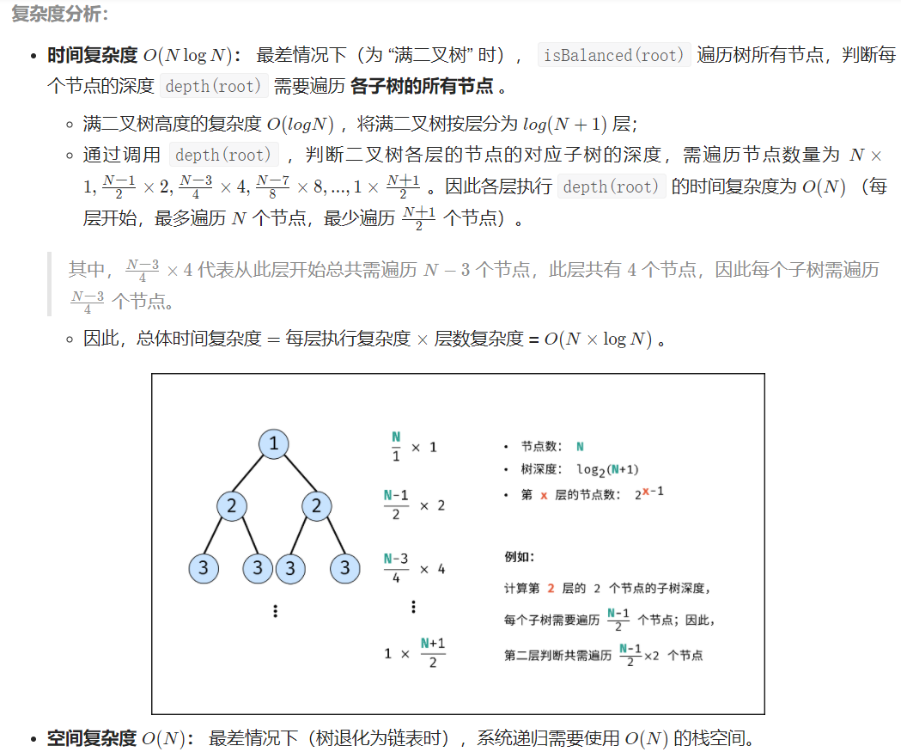

**方法2.后序遍历+剪枝（从底至顶）**

关键点： **此树的深度** 等于 **左子树的深度** 与 **右子树的深度** 中的 **最大值** +1 。

```python
class Solution:
    def isBalanced(self, root: TreeNode) -> bool:
        def depth(root):
            if not root : return 0
            left_depth = depth(root.left)
            if left_depth == -1: return -1
            right_depth = depth(root.right)
            if right_depth == -1: return -1
            return max(left_depth,right_depth)+1 if abs(left_depth-right_depth)<=1 else -1
        return depth(root) != -1
```

- 时间复杂度*O*(*N*)
- 空间复杂度*O*(*N*)

## 64.求1+2+...+n

常规的不让用，考点是逻辑运算符的短路效应。

```python
class Solution:
    def __init__(self):
        self.res = 0
    def sumNums(self, n: int) -> int:
        n > 1 and self.sumNums(n-1)
        self.res += n
        return self.res
```

- 时间复杂度*O*(*N*)
- 空间复杂度*O*(*N*)

## 68-I.二叉搜索树的最近公共祖先

借用二叉搜索树的性质；

**方法1.迭代**

```python
class Solution:
    def lowestCommonAncestor(self, root: 'TreeNode', p: 'TreeNode', q: 'TreeNode') -> 'TreeNode':
        while root:
            if root.val > p.val and root.val > q.val:
                root = root.left
            elif root.val < p.val and root.val < q.val:
                root = root.right
            else:
                break
        return root
```

- 时间复杂度*O*(*N*)
- 空间复杂度*O*(*1*)

**方法2.递归**

```python
class Solution:
    def lowestCommonAncestor(self, root: 'TreeNode', p: 'TreeNode', q: 'TreeNode') -> 'TreeNode':
        if root.val < p.val and root.val < q.val:
            return self.lowestCommonAncestor(root.right,p,q)
        if root.val > p.val and root.val > q.val:
            return self.lowestCommonAncestor(root.left,p,q)
        return root
```

- 时间复杂度*O*(*N*)
- 空间复杂度*O*(*N*)

## 68-II.二叉树的最近公共祖先

和上题类似，但不是二叉搜索树了，只能用递归的方法。

```python
class Solution:
    def lowestCommonAncestor(self, root: TreeNode, p: TreeNode, q: TreeNode) -> TreeNode:
        # 当为空返回null，当相等返回节点
        if not root or root == p or root == q : return root
        left = self.lowestCommonAncestor(root.left, p, q)
        right = self.lowestCommonAncestor(root.right, p, q)
        if not left and not right: return #1 两个都为空 返回null
        if not left: return right # 3.left为空,right不为空，可能存在两种情况。一个节点在right，or最近公共祖先在right。
        if not right: return left # 4.right为空，left不为空，同上。
        return root # 2.left和right都不为空，说明p,q在异侧，即是最近公共祖先。
```

- 时间复杂度*O*(*N*)
- 空间复杂度*O*(*N*)

<搜索与回溯（中等）>特殊的点挺多的，比如二叉树的节点深度，逻辑符号的妙用，最近公共祖先的回溯，这些题暂时没找到规律，只能多做多记忆。

------

## 7.重建二叉树


```python
class Solution:
    def buildTree(self, preorder: List[int], inorder: List[int]) -> TreeNode:
    	if inorder:
            node = TreeNode(preorder.pop(0))
            i = inorder.index(node.val)
            node.left = self.buildTree(preorder,inorder[:i])
            node.right = self.buildTree(preorder,inorder[i+1:])
            return node
```

- 时间复杂度*O*(*N*)
- 空间复杂度*O*(*N*)

## 16.数值的整数次方


```python
class Solution:
    def myPow(self, x: float, n: int) -> float:
        if x == 0.0 :return 0.0
        res = 1
        if n < 0:
            x = 1/x
            n = -n
        while n :
            if n & 1 :
                res *= x
            x *= x
            n >>= 1
        return res
```

- 时间复杂度*O*(*logN*)
- 空间复杂度*O*(*1*)

## 33.二叉搜索树的后续遍历序列

方法1：递归分治

```python
class Solution:
    def verifyPostorder(self, postorder: List[int]) -> bool:
        def recur(i,j):
            # 后序遍历序列为：左、右、根
            # 此子树的节点数量<=1，无需判断正确性
            if i >= j:return True
            p = i
            while postorder[p] < postorder[j]: p += 1
            m = p
            while postorder[p] > postorder[j]: p += 1
            return p == j and recur(i, m - 1) and recur(m, j - 1)
        
        return recur(0, len(postorder) - 1)
```

- 时间复杂度*O*(*N^2*)
- 空间复杂度*O*(*1*)

方法2：辅助单调栈

思路参考这个题解：https://leetcode.cn/problems/er-cha-sou-suo-shu-de-hou-xu-bian-li-xu-lie-lcof/solution/di-gui-he-zhan-liang-chong-fang-shi-jie-jue-zui-ha/

辅助单调栈用于存放比当前值大的值。

```python
class Solution:
    def verifyPostorder(self, postorder: List[int]) -> bool:
        stack, root = [], float("+inf")
        for i in range(len(postorder)-1,-1,-1):
            if postorder[i] > root : return False
            while (stack and postorder[i]<stack[-1]):
                root = stack.pop()
            stack.append(postorder[i])
        return True
```

- 时间复杂度*O*(*N*)
- 空间复杂度*O*(*N*)

<分治算法（中等）>这三道分治算法还是有点东西的，不一定要参考k神的答案，重建二叉树的递归思路很不错，计算数值的整数次方也要分治降低时间复杂度，后序遍历的判断，两种方法都挺难的，还是要多看两遍。

------

## 15.二进制中1的个数

方法1：逐位判断

```python
class Solution:
    def hammingWeight(self, n: int) -> int:
        res = 0
        while n :
            res += n & 1
            n >>= 1
        return res
```

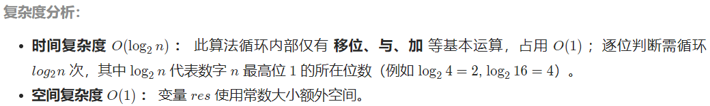

方法2：巧用` n&(n-1)`


```python
class Solution:
    def hammingWeight(self, n: int) -> int:
        res = 0
        while n :
            res += 1
            n &= n - 1
        return res
```

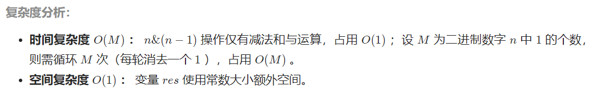

## 65.不用加减乘除做加法


```c++
class Solution {
public:
    int add(int a, int b) {
        while(b!=0){
            int c = (unsigned int) (a&b) << 1;
            a = a ^ b;
            b = c;
        }
        return a;
    }
};
```

这道题因为涉及无符号数，用python做很费劲。c++在某些题目上还是占优的。

- 时间复杂度*O*(*1*)
- 空间复杂度*O*(*1*)

## 56-I.数组中数字出现的次数


```python
class Solution:
    def singleNumbers(self, nums: List[int]) -> List[int]:
        x, y, n ,m = 0, 0, 0, 1
        # 1.遍历nums,异或得到 x^y
        for num in nums:
            n ^= num
        # 2.找到区别两个数组的标志位
        while n & m == 0:
            m <<= 1
        # 3.划分两个数组得到结果
        for num in nums:
            if num & m :
                x ^= num
            else:
                y ^= num
        return x,y
```

- 时间复杂度*O*(*N*)
- 空间复杂度*O*(*1*)

## 56-II.数组中数字出现的次数

方法1：有限状态机

此法甚妙，只是需要多看几遍消化。


```python
class Solution:
    def singleNumber(self, nums: List[int]) -> int:
        ones, twos = 0, 0
        for num in nums:
            ones = ones ^ num & ~twos
            twos = twos ^ num & ~ones
        return ones
```

- 时间复杂度*O*(*N*)
- 空间复杂度*O*(*1*)

方法2：遍历统计

计算其它的个数也仅需将m换成对应的数字即可。

```python
class Solution:
    def singleNumber(self, nums: List[int]) -> int:
		counts = [0] * 32
		for num in nums:
			for i in range(32):
				count[i] += num & 1
				num >>= 1
        res, m = 0, 3
        for i in range(31,-1,-1):
            res <<= 1
            res |= count[i] % m
        return res if counts[31] % m == 0 else ~(res ^0xffffffff)
```

- 时间复杂度*O*(*N*)
- 空间复杂度*O*(*1*)

<位运算>的题目还是很看经验的，多看几遍就能掌握了。

------

## 39.数组中出现次数超过一半的数字

三种方法：

1.借助哈希表，遍历

2.排序，返回中间元素

3.摩尔投票法


```python
class Solution:
    def majorityElement(self, nums: List[int]) -> int:
        votes = 0
        for num in nums:
            if not votes: 
                x = num
            if num == x:
                votes += 1
            else:
                votes -= 1
        return x
```

- 时间复杂度*O*(*N*)
- 空间复杂度*O*(*1*)

## 66.构建乘积数组


```python
class Solution:
    def constructArr(self, a: List[int]) -> List[int]:
        b = [1] * len(a)
        tmp = 1
        for i in range(1,len(a)):
            b[i] = b[i-1] * a[i-1]
        for i in range(len(a)-2,-1,-1):
            tmp *= a[i+1]
            b[i] *= tmp
        return b
```

- 时间复杂度*O*(*N*)
- 空间复杂度*O*(*1*)

## 14-I.剪绳子

方法1：动态规划

```python
class Solution:
    def cuttingRope(self, n: int) -> int:
        dp = [0] * (n + 1)
        for i in range(2, n + 1):
            for j in range(i):
                dp[i] = max(dp[i], j * (i - j), j * dp[i - j])
        return dp[n]
```

- 时间复杂度*O*(*N*)
- 空间复杂度*O*(*N*)

方法2：数学推导

结论是分成最多的3。

```python
class Solution:
    def cuttingRope(self, n: int) -> int:
        if n <= 3: return n - 1
        a, b = n // 3, n % 3
        if b == 0: return int(math.pow(3,a))
        if b == 1: return int(math.pow(3,a-1) * 4)
        return int(math.pow(3,a) * 2)
```

- 时间复杂度*O*(*1*)
- 空间复杂度*O*(*1*)

## 57-II.和为s的连续数组

方法1：双指针


```python
class Solution:
    def findContinuousSequence(self, target: int) -> List[List[int]]:
        i ,j ,s ,res = 1,2,3,[]
        while i < j:
            if s == target:
                res.append(list(range(i,j+1)))
            if s < target:
                j += 1
                s += j
            else:
                s -= i
                i += 1
        return res
```

- 时间复杂度*O*(*N*)
- 空间复杂度*O*(*1*)

方法2：数学公式

```python
class Solution:
    def findContinuousSequence(self, target: int):
        i, j, res = 1, 2, []
        while i < j:
            j = (-1 + (1 + 4 * (2 * target + i * i - i)) ** 0.5) / 2
            if j == int(j):
                res.append(list(range(i, int(j) + 1)))
            i += 1
        return res

作者：Krahets
链接：https://leetcode.cn/leetbook/read/illustration-of-algorithm/eth6p5/
来源：力扣（LeetCode）
著作权归作者所有。商业转载请联系作者获得授权，非商业转载请注明出处。
```

- 时间复杂度*O*(*N*)
- 空间复杂度*O*(*1*)

## 62.圆圈中最后剩下的数字

约瑟夫环问题；

可以参考：

https://leetcode.cn/problems/yuan-quan-zhong-zui-hou-sheng-xia-de-shu-zi-lcof/solution/javajie-jue-yue-se-fu-huan-wen-ti-gao-su-ni-wei-sh/


倒着推

初始状态是0

递推公式：`(当前index + m) % 上一轮剩余数字的个数`

```python
class Solution:
    def lastRemaining(self, n: int, m: int) -> int:
        x = 0
        for i in range(2,n+1):
            x = (x + m) % i
        return x
```

- 时间复杂度*O*(*N*)
- 空间复杂度*O*(*1*)

<数学>问题还是一如既往的难，多做几遍。

## 29.顺时针打印矩阵

```python
class Solution:
    def spiralOrder(self, matrix: List[List[int]]) -> List[int]:
        if not matrix: return []
        l, r, t, b = 0, len(matrix[0]) - 1, 0, len(matrix) - 1
        res = []
        while 1:
            # 从左到右
            for i in range(l,r+1):
                res.append(matrix[t][i])
            t += 1	
            if t > b: break
            # 从上到下
            for i in range(t,b+1):
                res.append(matrix[i][r])
            r -= 1
            if r < l: break
            # 从右到左
            for i in range(r,l-1,-1):
                res.append(matrix[b][i])
            b -= 1
            if b < t: break
            # 从下至上
            for i in range(b,t-1,-1):
                res.append(matrix[i][l])
            l += 1
            if l > r: break
        return res
```

- 时间复杂度*O*(*MN*)
- 空间复杂度*O*(*1*)

## 31.栈的压入、弹出序列

```python
class Solution:
    def validateStackSequences(self, pushed: List[int], popped: List[int]) -> bool:
        stack = []
        cur = 0
        for num in pushed:
            stack.append(num)
            while stack and stack[-1] == popped[cur]:
                stack.pop()
                cur += 1
        return cur == len(popped)
```

- 时间复杂度*O*(*N*)
- 空间复杂度*O*(*N*)

<模拟>两道题比较简单

<字符串（中等）>两道题：

20.表示数值的字符串 

67.把字符串转换成整数。

低频题，而且题目很复杂，不看了。

## 59-I.滑动窗口的最大值

思路可以借鉴 30.包含min函数的栈

维护一个非严格递减 单调栈

```python
class Solution:
    def maxSlidingWindow(self, nums: List[int], k: int) -> List[int]:
        if not nums or k == 0: return []
        deque = collections.deque()
        # 未形成窗口
        for i in range(k):
            # 保持双端队列是非严格递减
            while deque and deque[-1] < nums[i]:
                deque.pop()
            deque.append(nums[i])
        res = [deque[0]]
        for i in range(k,len(nums)):
            # 如果出窗口的值是最大值
            if deque[0] == nums[i-k]:
                deque.popleft()
            while deque and deque[-1] < nums[i]:
                deque.pop()
            deque.append(nums[i])
            res.append(deque[0])
        return res
```

- 时间复杂度*O*(*N*)
- 空间复杂度*O*(*k*)

## 59-II.队列的最大值

和上一题很类似。

```python
class MaxQueue:

    def __init__(self):
        self.A, self.B = collections.deque(), collections.deque()

    def max_value(self) -> int:
        if not self.A: return -1
        return self.B[0]

    def push_back(self, value: int) -> None:
        self.A.append(value)
        while self.B and self.B[-1] < value:
            self.B.pop()
        self.B.append(value)
    
    def pop_front(self) -> int:
        if not self.A: return -1
        if self.B[0] == self.A[0]:
            self.B.popleft()
        return self.A.popleft()        
```

- 时间复杂度*O*(*1*)
- 空间复杂度*O*(*N*)

## 37.序列化二叉树

层序遍历 转化为 字符串

再根据规律，反序列化为 二叉树

```python
# Definition for a binary tree node.
# class TreeNode(object):
#     def __init__(self, x):
#         self.val = x
#         self.left = None
#         self.right = None

class Codec:

    def serialize(self, root):
        """Encodes a tree to a single string.
        
        :type root: TreeNode
        :rtype: str
        """
        if not root :return "[]"
        queue = collections.deque()
        queue.append(root)
        res = []
        while queue:
            node = queue.popleft()
            if node:
                res.append(str(node.val))
                queue.append(node.left)
                queue.append(node.right)
            else:
                res.append("null")
        return '['+','.join(res) + ']'

    def deserialize(self, data):
        """Decodes your encoded data to tree.
        
        :type data: str
        :rtype: TreeNode
        """
        if data == "[]":return 
        vals, i = data[1:-1].split(','),1
        root = TreeNode(int(vals[0]))
        queue = collections.deque()
        queue.append(root)
        while queue:
            node = queue.popleft()
            if vals[i] != "null":
                node.left = TreeNode(int(vals[i]))
                queue.append(node.left)
            i += 1
            if vals[i] != "null":
                node.right = TreeNode(int(vals[i]))
                queue.append(node.right)
            i+=1
        return root

# Your Codec object will be instantiated and called as such:
# codec = Codec()
# codec.deserialize(codec.serialize(root))
```

- 时间复杂度*O*(*N*)
- 空间复杂度*O*(*N*)

## 38.字符串的排列

```python
class Solution:
    def permutation(self, s: str) -> List[str]:
        c, res = list(s), []
        def dfs(x):
            if x == len(c) - 1:
                res.append(''.join(c))   # 添加排列方案
                return
            dic = set()
            for i in range(x, len(c)):
                if c[i] in dic: continue # 重复，因此剪枝
                dic.add(c[i])
                c[i], c[x] = c[x], c[i]  # 交换，将 c[i] 固定在第 x 位
                dfs(x + 1)               # 开启固定第 x + 1 位字符
                c[i], c[x] = c[x], c[i]  # 恢复交换
        dfs(0)
        return res

作者：Krahets
链接：https://leetcode.cn/leetbook/read/illustration-of-algorithm/50hah3/
来源：力扣（LeetCode）
著作权归作者所有。商业转载请联系作者获得授权，非商业转载请注明出处。
```

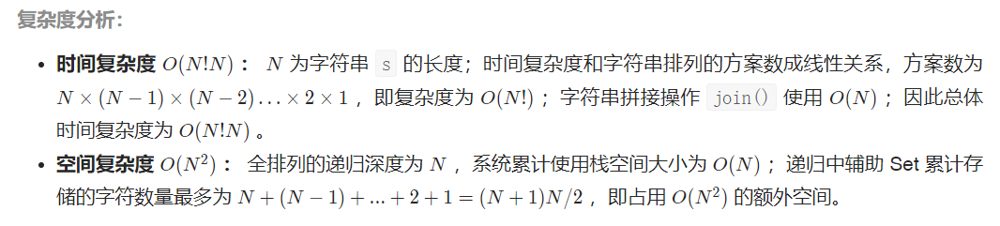

## 19.正则表达式匹配


## 49.丑数


```python
class Solution:
    def nthUglyNumber(self, n: int) -> int:
        dp, a, b, c = [1] * n, 0, 0, 0
        for i in range(1,n):
            n2, n3, n5 = dp[a] * 2, dp[b] * 3, dp[c] * 5
            dp[i] = min(n2, n3, n5)
            if dp[i] == n2: a += 1
            if dp[i] == n3: b += 1
            if dp[i] == n5: c += 1
        return dp[-1]
```

- 时间复杂度*O*(*N*)
- 空间复杂度*O*(*N*)

## 60.n个骰子的点数

看题解，多看两遍

```python
class Solution:
    def dicesProbability(self, n: int) -> List[float]:
        dp = [1.0 / 6.0] * 6
        for i in range(2, n + 1):
            tmp = [0] * (5 * i + 1)
            for j in range(len(dp)):
                for k in range(6):
                    tmp[j + k] += dp[j]/6
            dp = tmp
        return dp
```

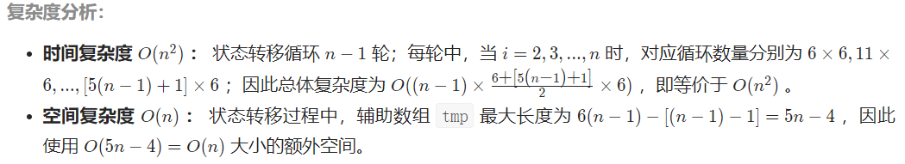
