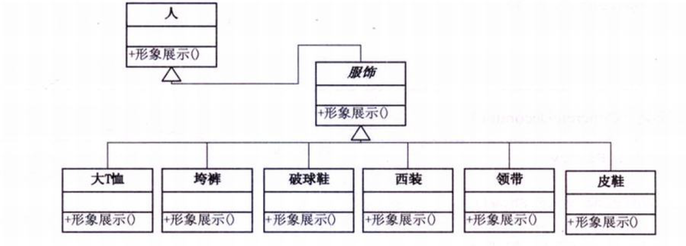
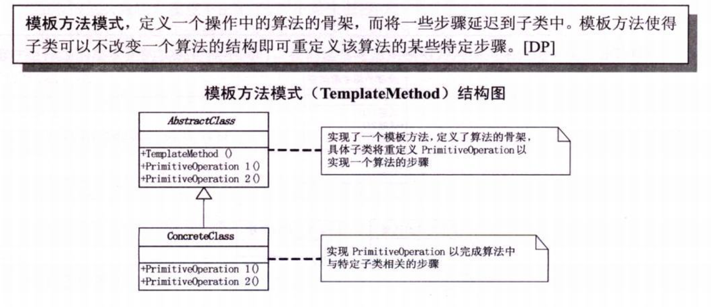

# 1. 代码无错就是优？简单工厂模式

UML类图


简单工厂类

用一个单独的类来做这个创造实例的过程。

```c#
public class OperationFactory
{
    public static Operation createOperate(string operate)
    {
        Operation oper = null;
        switch (operate)
        {
            case "+":
                oper = new OperationAdd();
                break;
            case "+":
                oper = new OperationSub();
                break;
            case "*":
                oper = new OperationMul();
                break;
            case "/":
                oper = new OperationDiv();
                break;
        }
        return oper;
    }
}
```

运算类（父类:抽象类，没有实例）

```C#
public class Operation
{
    private double _numberA = 0;
    private double _numberB = 0;
    
    public double NumberA
    {
        get {return _numberA;}
        set {_numberA = value;}
    }
    public double NumberB
    {
        get { return _numberB;}
        set { _numberB = value;}
    }
    public virtual double GetResult()
    {
        double result = 0;
        return result;
    }
}
```

加减乘除类（子类）

```c#
class OperationAdd: Operation
{
    public override double GetResult()
    {
        double result = 0;
        result = NumberA + NumberB;
        return result
    }
}

class OperationSub: Operation
{
    public override double GetResult()
    {
        double result = 0;
        result = NumberA - NumberB;
        return result
    }
}

class OperationMul: Operation
{
    public override double GetResult()
    {
        double result = 0;
        result = NumberA * NumberB;
        return result
    }
}

class OperationDiv: Operation
{
    public override double GetResult()
    {
        double result = 0;
        if (NumberB == 0)
            throw new Exception("除数不能为0,。");
        result = NumberA / NumberB;
        return result
    }
}
```

客户端代码

```C#
Operation oper;
oper = OperationFactory.createOperate("+");
oper.NumberA = 1;
oper.NumberB = 2;
double result = oper.GetResult();
```

# 2.商场促销-策略模式

**面向对象的编程，并不是类越多越好，类的划分是为了封装，但分类的基础是抽象，具有相同属性和功能的对象的抽象集合才是类。**

工厂模式UML图如下：


但是面对算法的时常变动，考虑其它设计模式；

**策略模式定义了算法家族，分别封装起来，让它们之间可以互相替换，此模式让算法的变化，不会影响到使用算法的客户。**

策略模式UML图：


Strategy类，定义所有支持的算法的公共接口

```c#
// 抽象算法类
abstract class Strategy
{
    //算法方法
    public abstract void AlgorithmInterface();
}
```

ConcreteStrategy,封装了具体的算法或行为，继承于Strategy

```c#
//具体算法A 
class ConcreteStrategyA: Strategy
{
    // 算法A实现方法
    public override void AlgorithmInterface()
    {
        Console.WriteLine("算法A 实现");
    }
}
//具体算法B 
class ConcreteStrategyB: Strategy
{
    // 算法B实现方法
    public override void AlgorithmInterface()
    {
        Console.WriteLine("算法B 实现");
    }
}
//具体算法C 
class ConcreteStrategyC: Strategy
{
    // 算法C实现方法
    public override void AlgorithmInterface()
    {
        Console.WriteLine("算法C 实现");
    }
}
```

Context,用一个ConcreteStrategy来配置，维护一个对Strategy对象的引用。

```c#
//上下文
class Context
{
    Strategy strategy;
    //初始化时，传入具体的策略对象
    public Context(Strategy strategy)
    {
        this.strategy = strategy;
    }
    // 上下文接口
    // 根据具体的策略对象，调用其算法的方法
    public void ContextInterface()
    {
        strategy.AlgorithmInterface();
    }
}
```

客户端代码

```c#
static void Main(string[] args)
{
    Context context;
    // 由于实例化不同的策略，所以最终在调用context.ContextInterface();时，所获得的结果就不尽相同
    context = new Context(new ConcreteStrategyA());
    context.ContextInterface();
    
    context = new Context(new ConcreteStrategyB());
    context.ContextInterface();
    
    context = new Context(new ConcreteStrategyB());
    context.ContextInterface();
    
    Console.Read();
}
```

但是可以发现此时用客户端去判断是哪一个算法。这样会使客户端代码变得复杂，于是需要考虑将判断的过程从客户端移走。**方法是将简单工厂和策略模式的Context结合。**

这样，客户端实例化的仅有Context一个对象，将具体的收费算法与客户端所分离，耦合更低。

总结：

- 策略模式是一种定义一系列算法的方法，从概念上来看，所有这些算法完成的都是相同的工作，只是实现不同，它可以以相同的方式调用所有的算法，减少了各种算法类与使用算法类之间的耦合。
- 策略模式的Strategy类层次为Context定义了一系列的可供重用的算法或行为。继承有助于析取出这些算法中的公共功能。
- 策略模式的优点是简化了单元测试，因为每个算法都有自己的类，可以通过自己的接口单独测试。
- 当不同的行为堆砌在一个类中，就很难避免使用条件语句来选择合适的行为。将这些行为封装在一个个独立的Strategy类中，可以在使用这些行为的类中消除条件语句。
- 策略模式就是用来封装算法的，但在实践中，我们发现可以用它来封装几乎任何类型的规则，只要分析过程中听到需要在不同的时间应用不同的业务规则，就可以考虑使用策略模式处理这种变化的可能性。
- 在基本的策略模式中，选择所用具体实现的职责由客户端对象承担，并转给策略模式的Context对象。但当结合简单工厂模式后，可以转移由Context判断，减轻客户端的职责。
- 任何需求的变更都是需要成本的。

# 3.拍摄UFO-单一职责原则

（本章没有代码，仅仅是说明一种思想）

- **单一职责原则（SRP)：就一个类而言，应该仅有一个引起它变化的原因。**
- 如果一类承担的职责过多，就等于吧这些职责耦合在一期，一个职责的变化可能会削弱或者抑制这个类完成其他职责的能力。这些耦合会导致脆弱的设计，当变化发送时，设计会遭受到意想不到的破坏。
- 软件设计真正要做的许多内容，就是发现职责并把那些职责相互分离。

# 4.考研求职两不误——开发-封闭原则

（本章没有代码，仅仅是说明一种思想）

开放-封闭原则（The Open-Closeed Principle，简称OCP）：是说软件实体（类、模块、函数等等）应该可以扩展，但是不可修改。

- 对于扩展是开放的（Open for extension）
- 对于更改是封闭的(Closed for modification)

总结：

- 无论模块是多么的“封闭”，都会存在一些无法对之封闭的变化。既然不可能完全封闭，设计人员必须对于他设计的模块应该对哪种变化封闭做出选择。他必须先猜测出最有可能发生的变化种类，然后构造抽象来隔离那些变化。
- 等到变化发送时立即采取行动。
- 在我们最初编写代码时，假设变化不会发生。当变化发送时，我们就创建抽象来隔离以后发生的同类变化。
- 面对需求，对程序的改动是通过增加新代码进行的，而不是更改现有的代码。
- 我们希望的是开发工作展开不久就知道可能发生的变化。查明可能发生的变化所等待的时间越长，要创建正确的抽象就越困难。
- **开放-封闭原则是面向对象设计的核心所在。遵循这个原则可以带来面向对象技术所声称的巨大好处，也就是可维护、可扩展、可复用、灵活性好。开发人员应该仅对程序中呈现出频繁变化的那些部分做出抽象，然而，对于应用程序中的每个部分都刻意地进行抽象同样不是一个好主意。拒绝不成熟的抽象和抽象本身一样重要。**

# 5.会修电脑不会修录音机——依赖倒转原则

依赖倒转原则：（针对接口编程，不要对实现编程）

- 高层模块不应该依赖低层模块。两个都应该依赖抽象。
- 抽象不应该依赖细节。细节应该依赖抽象。

**里氏代换原则**：子类型必须能够替换掉它们的父类型。一个软件实体如果使用的是一个父类的话，那么一定适用于其子类，而且它察觉不出父类对象和子类对象的区别。也就是说，在软件里面，把父类都替换成它的子类，程序的行为没有变化。

-  只有当子类可以替换掉父类，软件单位的功能不受到影响时，父类才能真正被复用，而子类也能够在父类的基础上增加新的行为。
- 由于子类型的可替换性才使得使用父类类型的模块在无需修改的情况下就可以扩展。

高层依赖低层：


高层不依赖低层


**依赖倒转其实可以说是面向对象设计的标志，用哪种语言来编写程序不重要，如果编写时考虑的都是如何针对抽象编程而不是针对细节编程，即程序中所有的依赖关系都是终止于抽象类或者接口，那就是面向对象的设计，反之那就是过程化的设计了。**

# 6.穿什么有这么重要？——装饰模式

需要把所需的功能按正确的顺序串联起来进行控制。

**装饰模式：动态地给一个对象添加一些额外的职责，就增加功能来说，装饰模式比生成子类更为灵活。**


**Component是定义一个对象接口，可以给这些对象动态的增加职责。ConcreteComponent是定义了一个具体的对象，也可以给这个对象添加一些职责。Decorator，装饰抽象类，继承了Component,从外类来扩展Component类的功能，但对于Component来说，是无需知道Decorator的存在的。至于ConcreteDecorator就是具体的装饰对象，起到给Component添加职责的功能。**

Component类

```c#
abstract class Component
{
    public abstract void Operation();
}
```

ConcreteComponent类

```c#
class ConcreteComponent : Component
{
    public override void Operation()
    {
        Console.WriteLine("具体对象的操作");
    }
}
```

Decorator类

```c#
abstract class Decorator : Component
{
    protected Component component;
    
    public void SetComponent(Component component)
    {
        this.component =  component;
    }
    // 重写Operation(),实际执行的是Component的Operation
    public override void Operation()
    {
        if (component != null)
        {
            component.Operation();
        }
    }
}
```

ConcreteDecoratorA类

```c#
class ConcreteDecoratorA : Decorator
{
    private string addedState;
    
    public override void Operation()
    {
        base.Operation();
        addedState = "New State";
        Console.WriteLine("具体装饰对象A的操作");
    }
}

class ConcreteDecoratorA : Decorator
{
    private string addedState;
    
    public override void Operation()
    {
        base.Operation();
        AddedBehavior();
        Console.WriteLine("具体装饰对象B的操作");
    }
    
    private void AddedBehavior()
    {
        
    }
}
```

客户端代码

```c#
static void Main(string[] args)
{
    ConcreteComponent c = new ConcreteComponent();
    ConcreteDecoratorA d1 = new ConcreteDecoratorA();
    ConcreteDecoratorB d2 = new ConcreteDecoratorB();
    
    d1.SetComponent(c);
    d2.SetComponent(d1);
    d2.Operation();
    
    Console.();
}
```

- 装饰模式是利用SetComponent来对对象进行包装的。这样每个装饰对象的实现就和如何使用这个对象分离开了，每个装饰对象只关心自己的功能，不需要关心如何被添加到对象链当中。

- 如果只有一个ConcreteComponent类而没有抽象的Component类，那么Decorator类可以是ConcreteComponent的一个子类。同样道理，如果只有一个ConcreteDecorator类，那么就没有必要建立一个单独的Decorator类，而可以把Decorator和ConcreteDecorator的责任合并成一个类



- 装饰模式是为已有功能动态地添加更多功能的一种方式
- 优点：把类中的装饰功能从类中搬移去除，这样可以简化原有的类。有效地把类的核心职责和装饰功能区分开了。而且可以去除相关类中重复的装饰逻辑。

# 7.为别人做嫁衣——代理模式

代理模式（Proxy)：为其他对象提供一种代理以控制对这个对象的访问。


应用场合：

- 远程代理，也就是为一个对象在不同的地址空间提供局部代表 。这样可以隐藏一个对象存在于不同地址空间的事实。
- 虚拟代理，是根据需要创建开销很大的对象。通过它来存放实例化需要很长时间的真实对象。
- 安全代理，用来控制真实对象访问时的权限。
- 智能指引，是指当调用真实的对象时，代理处理另外一些事。

# 8.雷锋依然在人间——工厂方法模式

**工厂方法模式，定义一个用于创建对象的接口，让子类决定实例化哪一个类。工厂方法使一个类的实例化延迟到其子类。**


工厂模式下的计算器


工厂方法克服了简单工厂违背开放-封闭原则的缺点，又保持了封装对象创建过程的优点。

# 9.简历复印——原型模式

**原型模式：用原型实例指定创建对象的种类，并且通过拷贝这些原型创建新的对象。**


- 一般在初始化的信息不发送变化的情况下，克隆是最好的办法。这既隐藏了对象创建的细节，又对性能是大大的提高。
- 优点：相比直接new，原型模式不用重新初始化对象（加载构造函数），而是动态地获得对象运行时的状态。

浅拷贝和深拷贝，这里默认用的是浅拷贝，如果需要深拷贝还需要再加一层。

# 10.考题抄错会做也白搭——模板方法模式



- 模板方法模式是通过把不变行为搬到超类，去除子类中的重复代码来体现它的优势。
- 提供了一个很好的代码复用平台。
- 当不变的和可变的行为在方法的子类实现中混合在一起的时候，不变的行为就会在子类中重复出现。我们通过模板方法把这些行为搬移到单一的地方，这样就帮助子类摆脱重复的不变行为的纠缠。

# 11.无熟人难办事？——迪米特法则

迪米特法则 也叫最少知识原则，如果两个类不必彼此直接通信，那么这两个类就不应当发生直接的相互作用。如果其中一个类需要调用另一个类的某一个方法的话，可以通过第三者转发这个调用。

- 在类的结构设计上，每一个类都应当尽量降低成员的访问权限
- 迪米特法则其根本思想，是强调了类之间的松耦合。
- 类之间的耦合越弱，越有利于复用，一个处在弱耦合的类被修改，不会对有关系的类造成波及。

# 12.牛市股票还会亏钱？——外观模式


何时使用外观模式？

- 首先，在设计初期阶段，应该要有意识的将不同的两个层分离，层与层之间建立外观Facade
- 其次，在开发阶段，子系统往往因为不断的重构演化而变得越来越复杂，增加外观Facade可以提供一个简单的接口，减少它们之间的依赖。
- 第三，在维护一个遗留的大型系统时，可能这个系统已经非常难以维护和扩展了。可以为新系统开发一个外观Facade类，来提供设计粗糙或高度复杂的遗留代码的比较清晰简单的接口，让新系统与Facade对象交互，Facade与遗留代码交互所有复杂的工作。

# 13.好菜每回味不同——建造者模式

将一个复杂对象的构建与它的表示分离，使得同样的构建过程可以创建不同的表示。


# 14.老板回来，我不知道——观察值模式


# 15.就不能不换DB吗？——抽象工厂模式

提供一个创建一系列相关或相互依赖对象的接口，而无需指定它们具体的类。


# 16.无尽加班何时休——状态模式

当一个对象的内在状态改变时允许改变其行为，这个对象看起来像是改变了其类。


# 17.在NBA我需要翻译——适配器模式


# 18.如果再回到从前——备忘录模式


# 19.分公司=一部门——组合模式


# 20.想走？可以！先买票——迭代器模式


# 21.有些类也需计划生育——单例模式

单例模式（Singleton)，保证一个类仅有一个实例，并提供一个访问它的全局访问点。

**通常我们可以让一个全局变量使得一个对象被访问，但它不能防止你实例化多个对象。一个最好的办法就是，让类自身负责保存它的唯一实例。这个类可以保证没有其他实例可以被创建，并且它可以提供一个访问该实例的方法。**


```c#
class Singleton
{
    private static Singleton instance;
    
    private Singleton()
    {}
    
    public static Singleton GetInstance()
    {
        if (instance == null)
        {
            instance = new Singleton();
        }
        return instance;
    }
}
```

客户端代码

```c#
static void Main(string[] args)
{
    Singleton s1 = Singleton.GetInstance();
    Singleton s2 = Singleton.GetInstance();
    
    if (s1 == s2)
    {
        Console.WriteLine("两个对象是相同的实例。");
    }
    Console.Read();
}
```

- 单例模式因为Singleton类封装它的唯一实例，这样它可以严格地控制客户怎样访问它以及何时访问它。简单地说就是对唯一实例的受控访问。

多线程时的单例，有可能创建多个实例，由此可以增加锁：**lock是确保当一个线程位于代码的临界区，另一个线程不进入临界区。如果其他线程试图进入锁定的代码，则它将一直等待，直到该对象被释放。**

```c#
class Singleton
{
    private static Singleton instance;
    private static readonly object syncRoot = new object();
    private Singleton()
    {
        
    }
    
    public static Singleton GetInstance()
    {
        lock (syncRoot)
        {
            if (instance == null)
            {
                instance = new Singleton();
            }
        }
        return instance;
    }
}
```

**双重锁定**(Double-check locking)

```c#
class Singleton
{
    private static Singleton instance;
    private static readonly object syncRoot = new object();
    private Singleton()
    {
        
    }
    
    public static Singleton GetInstance()
    {
        if (instance == null)
        {
            lock (syncRoot)
        	{
            	if (instance == null)
            	{
                instance = new Singleton();
            	}
        	}
        }
        return instance;
    }
}
```

**静态初始化**

C#与公共语言运行库也提供了一种“静态初始化”方法，这种方法不需要开发人员显式地编写线程安全代码，即可解决多线程环境下它是不安全的问题。

```c#
// 阻止发生派生，而派生可能会增加实例
public sealed class Singleton
{
    // 在第一次引用类的任何成员时创建实例。公共语言运行库负责处理变量初始化。
    private static readonly Singleton instance = new Singleton();
    private Singleton() {}
    public static Singleton GetInstance()
    {
        return instance;
    }
}
```

- 这种静态初始化的方式是在自己被加载时就将自己实例化，所以被形象地称之为饿汉式单例类。
- 原先的单例模式处理方式是要在第一次被引用时，才会将自己实例化，所以被称为懒汉式单例类。

# 22.手机软件何时统一——桥接模式


# 23.烤羊肉串引来的思考——命令模式


# 24.加薪非要老总批？——职责链模式

使多个对象都有机会处理请求，从而避免请求的发送者和接受者之间的耦合关系。将这个对象连成一条链，并沿着这条链传递该请求，直到有一个对象处理它为止。


# 25.世界需要和平——中介者模式


# 26.项目多也别傻做——享元模式


# 27.其实你不懂老板的心——解释器模式


# 28.男人和女人——访问者模式


# 29.OOTV杯超级模式大赛——模式总结

书写的非常好！尤其是各个模式之间的对比！建议多看两遍！

